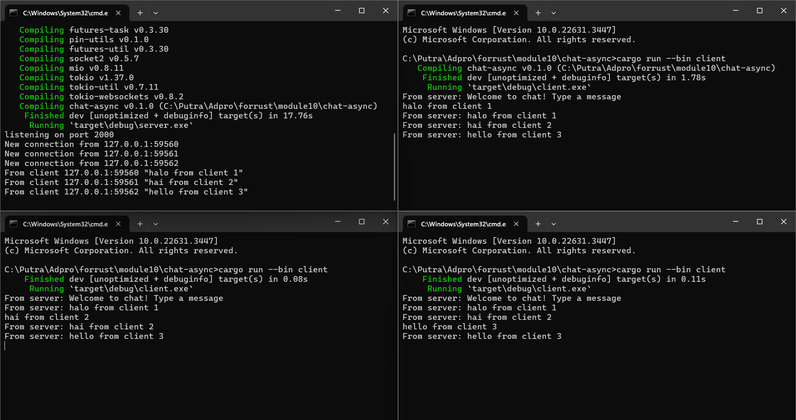
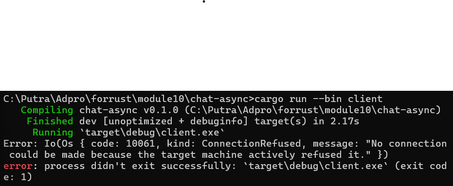
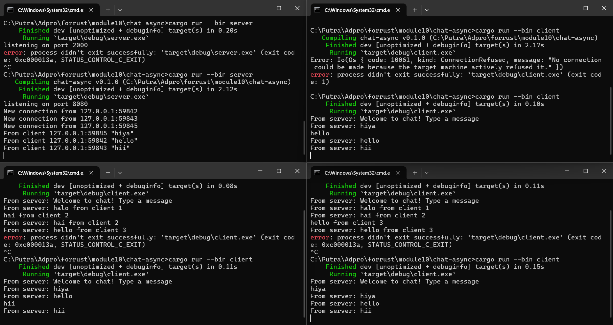
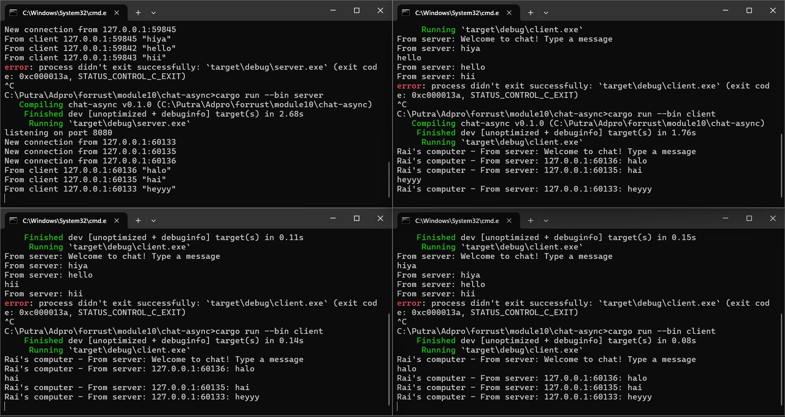

# Reflection

### Original broadcast chat



Server dijalankan dengan perintah `cargo run --bin server` dan masing-masing *client* dijalankan dengan perintah `cargo run --bin client`. Ketika diberikan text pada para *client*, input akan dibaca dan dikirimkan ke server. Lalu server akan menyiarkan setiap pesan yang diterimanya kepada semua *client*.

### Change port



Ketika port pada *client* diubah maka koneksi ke server ditolak secara aktif. *Client* tidak akan dapat terhubung ke server karena *client* mencoba untuk terhubung ke port yang berbeda dari yang digunakan oleh server. Maka port pada server juga perlu diubah. Kedua fungsi menggunakan protokol websocket yang sama yang mengirim dan menerima pesan antara *client* dan server.



### Small changes



Pada `server.rs` 

``` rust
bcast_tx.send(text.into())?;
```

diubah menjadi

```rust
bcast_tx.send(format!("{:?}: {}", addr, text))?;
```

Pesan *broadcast* diubah untuk menyertakan alamat *client* (SocketAddr). Ketika *client* menerima *broadcast*, pesan tersebut sudah menyertakan alamat *client* di dalam pesan itu sendiri.


